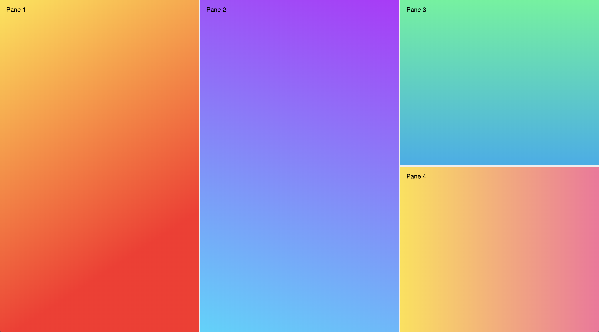

# Material UI Test - Panes




This is a code test for [Material UI](https://material-ui.com/). The [task](https://gist.github.com/oliviertassinari/38e50066df8894a7c4e0b46b39b42cb8) was to create a React component for resizable panes.

[LIVE DEMO](https://mui-panes.netlify.com)

# Usage

```ts
<Panes panes={[
  <span className="pane1">Pane 1</span>,
  <span className="pane2">Pane 2</span>,
  <Panes vertical panes={[
    <span className="pane3">Pane 3</span>,
    <span className="pane4">Pane 4</span>
  ]} />
]} />
```

## Customization
This library supplies CSS variables for styling:
- `--pane-padding`: Change each panes padding
- `--pane-handle`: Change the color of the handle
- `--pane-handle-hover`: Change the color of the handle when hovered
